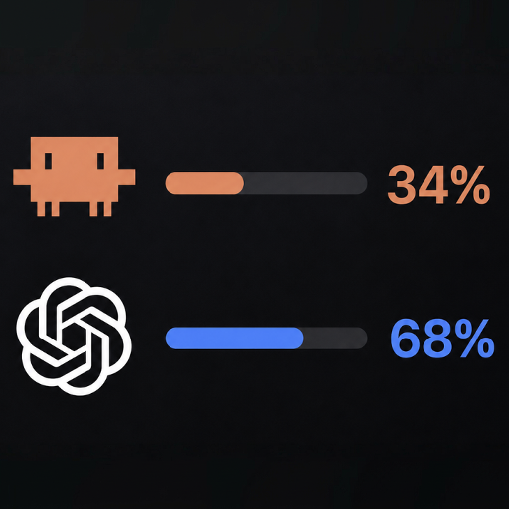

# AI Usage

A native macOS desktop widget that shows live usage for **Claude Code** and
**OpenAI Codex** side by side. Drop it into Notification Center and you can
see your session burn, weekly caps, and reset timers at a glance — without
opening claude.ai or chatgpt.com.

<p align="center">
  
</p>

## Features

- **Three widget sizes** (Small, Medium, Large) — pick whichever fits your
  taste; all three render Claude and Codex consistently.
- **Live data, not local guesses** — pulls real plan usage directly from
  `claude.ai/api/organizations/.../usage` and from
  `chatgpt.com/backend-api/codex/usage`. Refreshes every 5 minutes.
- **Detects what you have installed** — if you only use Claude Code,
  Codex hides itself (and vice versa). No empty placeholders.
- **One-click claude.ai sign-in** — embedded WKWebView grabs your
  `sessionKey` cookie. No copy-pasting cURL.
- **Codex needs zero setup** — auto-reads `~/.codex/auth.json` after you've
  run `codex login` once.
- **Run at login** — toggleable from the host app (uses `SMAppService`).
- **Companion preview pane** — see every widget size + every provider-state
  combination (`Live`, `Both`, `Claude only`, `Codex only`) inside the app
  before adding the widget.

## Installation

### Quickest path

1. Download the latest `AI-Usage-*.dmg` from
   [Releases](../../releases) (signed with Developer ID and notarized).
2. Open the DMG → drag **AI Usage** to `/Applications`.
3. Launch **AI Usage**. The first run sets up the widget extension with the
   system.
4. Open Notification Center → **Edit Widgets** → search **AI Usage** →
   pick Small, Medium, or Large.

### Build from source

Requirements: macOS 14+, Xcode 15+, [XcodeGen](https://github.com/yonaskolb/XcodeGen)
(`brew install xcodegen`).

```bash
git clone https://github.com/<you>/claude-usage.git
cd claude-usage
xcodegen generate
open ClaudeUsage.xcodeproj
```

Or with no Xcode IDE:

```bash
xcodegen generate
xcodebuild \
  -project ClaudeUsage.xcodeproj \
  -scheme ClaudeUsage \
  -configuration Debug \
  -derivedDataPath ./build \
  CODE_SIGNING_ALLOWED=NO build
open "./build/Build/Products/Debug/AI Usage.app"
```

### Build a signed/notarized DMG

The `release.sh` helper does the whole signed-DMG flow:

```bash
./release.sh                 # signed .dmg (one-time Gatekeeper warning)
./release.sh --notarize      # signed + notarized + stapled (no warning)
```

First-time notarization setup:

```bash
xcrun notarytool store-credentials ai-usage \
  --apple-id you@example.com \
  --team-id <YOUR_TEAM_ID> \
  --password <APP_SPECIFIC_PW>
```

Generate the app-specific password at [appleid.apple.com](https://appleid.apple.com).

## How it works

### Sign-in flow

- **Claude Code** → opens `https://claude.ai/login` inside a WKWebView,
  observes its `WKHTTPCookieStore`, and captures the `sessionKey` cookie the
  moment login succeeds. Stored in the Keychain (`ClaudeUsageWidget-Session`).
- **Codex** → reads `~/.codex/auth.json` directly. The bearer token written
  there by `codex login` is everything the API needs.

### Data flow

```
   Host app (unsandboxed)              Widget extension (sandboxed)
   ────────────────────────────        ────────────────────────────
   Refresher.tick() every 5 min  ──►   PlanCache.load()   ──► UI
     ├─ ClaudeAccountAPI                CodexCache.load()  ──► UI
     │    (sessionKey cookie)
     └─ CodexAccountAPI
          (bearer from auth.json)
                │
                ▼
        SharedContainer  ← single source of truth: writes JSON into
                          the widget's own sandbox container so the
                          widget can read it without App Groups.
```

App Groups are *not* used — wildcard provisioning profiles strip the
entitlement, so the host writes directly to
`~/Library/Containers/com.marcovhv.claudeusage.widget/Data/Library/Application Support/`,
which the widget can read from its own sandbox.

### Local fallback

If a network call fails, the widget falls back to scanning your local
`~/.claude/projects/**/*.jsonl` and `~/.codex/sessions/**/*.jsonl` for a
best-effort summary so the rings aren't blank.

## Privacy

- No analytics, telemetry, or external servers — every request goes
  straight to `claude.ai` or `chatgpt.com` from your Mac.
- Cookies/tokens stay in the macOS Keychain.
- Cached JSON usage data lives in the widget's sandbox container; delete the
  app to delete the cache.

## Project layout

```
Sources/
  App/      ─ Host app target (unsandboxed): refresh loop, login sheet,
              auth + API clients, preview UI.
  Widget/   ─ WidgetKit extension target (sandboxed): TimelineProvider,
              reads cache from the shared on-disk location.
  Shared/   ─ Code compiled into both targets: data models, JSONL scanner,
              widget views (Small/Medium/Large), theme.
Resources/
  Assets.xcassets/  ─ App icon + logo image sets.
images/             ─ Source PNGs (clawd, openai, icon).
project.yml         ─ XcodeGen spec — single source of truth for the
                     Xcode project.
release.sh          ─ Build + sign + (optional) notarize a DMG.
```

## Roadmap / known limits

- Claude.ai login must complete in the embedded WKWebView. Google SSO
  occasionally trips reCAPTCHA inside web views; if that happens, the sheet
  still works — just complete the challenge.
- Widget extension is sandboxed (macOS requires it). Host app is
  unsandboxed because it scans `~/.claude` and `~/.codex` directly.
- All requests go straight to vendor APIs. No retries, no rate-limit
  backoff. If they 5xx, the widget keeps the last cache.

## Credits

Made by **Marco van Hylckama Vlieg**.

- Web — [ai-created.com](https://ai-created.com/)
- X — [@AIandDesign](https://x.com/AIandDesign)
- ☕ [Buy me a coffee](https://ko-fi.com/aianddesign)

Claude and Anthropic logos belong to Anthropic. OpenAI / Codex logos belong
to OpenAI. This is an independent third-party tool with no affiliation with
either company.
